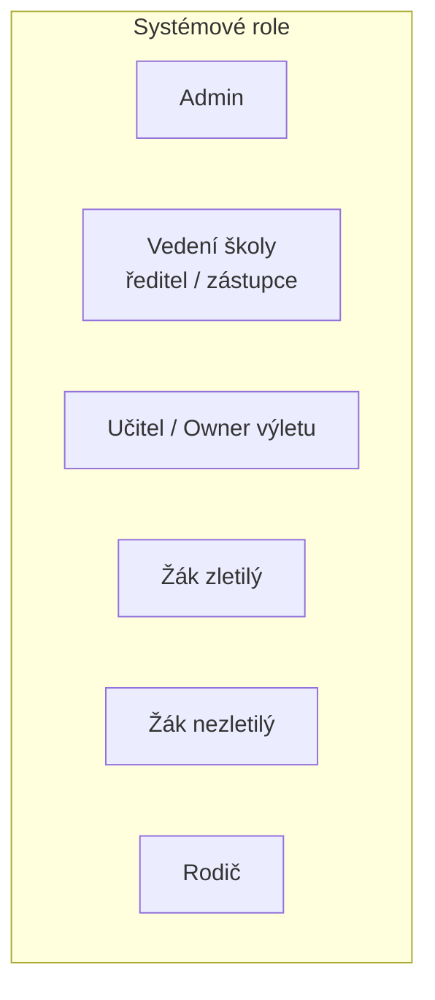
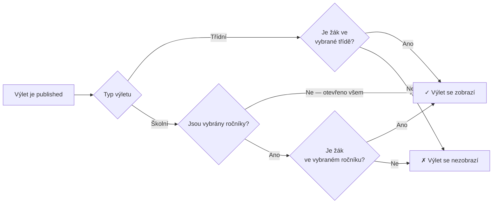
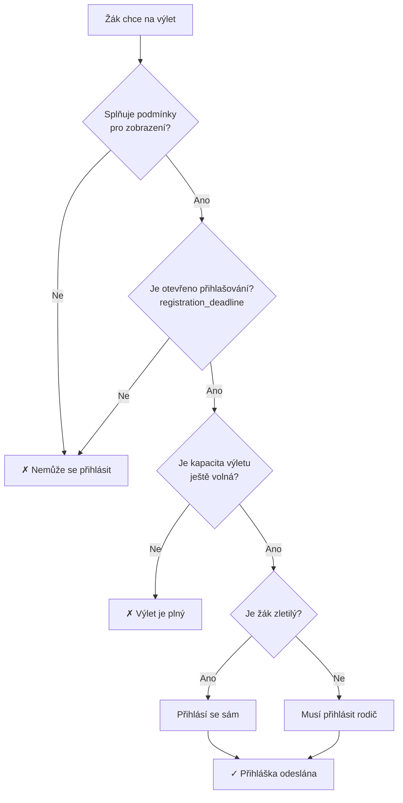

# Role a oprávnění

## Přehled rolí

## Matice oprávnění

| Akce | Admin | Vedení | Učitel (owner) | Učitel (neowner) | Žák zletilý | Žák nezletilý | Rodič |
|------|:-----:|:------:|:--------------:|:----------------:|:-----------:|:-------------:|:-----:|
| Vytvořit výlet | ✓ | ✓ | ✓ | ✓ | — | — | — |
| Editovat svůj výlet (draft/returned) | ✓ | — | ✓ | — | — | — | — |
| Odeslat výlet ke schválení | ✓ | — | ✓ | — | — | — | — |
| Schválit / zamítnout / vrátit výlet | ✓ | ✓ | — | — | — | — | — |
| Publikovat schválený výlet | ✓ | — | ✓ | — | — | — | — |
| Vidět výlet (published, splňuje podmínky) | ✓ | ✓ | ✓ | ✓ | ✓ | ✓ | ✓ |
| Přihlásit se na výlet | — | — | — | — | ✓ | — | — |
| Přihlásit nezletilé dítě | — | — | — | — | — | — | ✓ |
| Schvalovat přihlášky (školní výlet) | ✓ | — | ✓ | — | — | — | — |
| Zrušit přihlášku | — | — | ✓ | — | ✓ | — | ✓ |
| Zobrazit všechny výlety (admin pohled) | ✓ | ✓ | — | — | — | — | — |

## Podmínky pro zobrazení výletu žákovi

## Podmínky pro přihlášení na výlet

## Poznámky k implementaci

### Určení zletilosti
- `is_adult` na `USER` se počítá z `birth_date` dynamicky nebo se aktualizuje denním jobbem
- Doporučeno: dynamická kontrola při přihlašování (`birth_date + 18 let ≤ today`)

### Napojení rodič–dítě
- Rodič vidí pouze děti napojené přes `PARENT_STUDENT`
- Přihlásit může pouze děti, které splňují podmínky výletu

### Vedení vs. Admin
- `management` = ředitel / zástupce — schvaluje výlety
- `admin` = systémový správce — má přístup ke všemu pro technickou správu
- Může být jedna role s různými podsady oprávnění (upřesnit s týmem)
