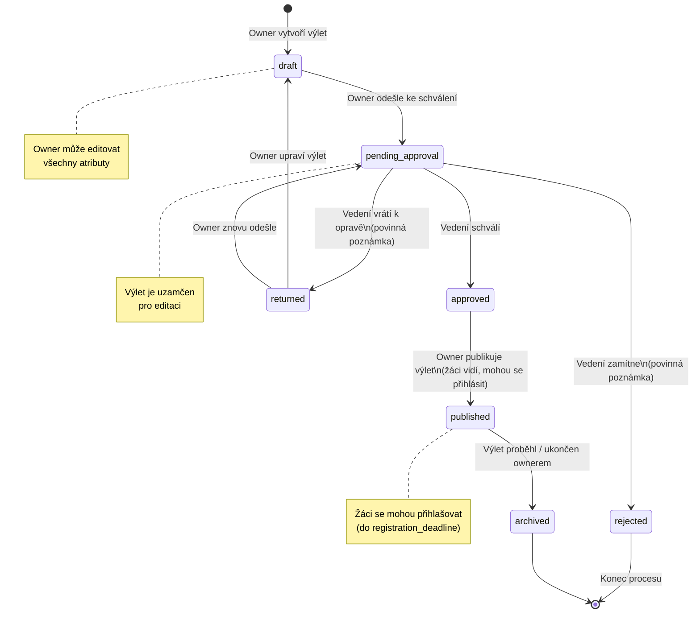
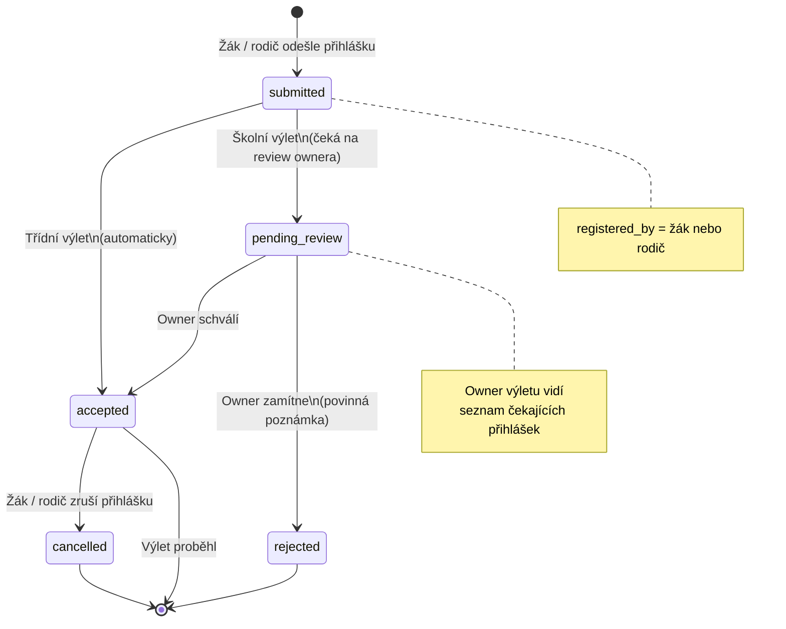

# Stavové diagramy

## 1. Stavy výletu

---

## 2. Stavy přihlášky žáka

---

## 3. Přehled přechodů a podmínek

### Výlet

| Z → Do | Kdo | Podmínka |
|--------|-----|----------|
| `draft` → `pending_approval` | Owner | Výlet má vyplněna povinná pole |
| `pending_approval` → `approved` | Vedení | — |
| `pending_approval` → `rejected` | Vedení | Povinná poznámka |
| `pending_approval` → `returned` | Vedení | Povinná poznámka |
| `returned` → `draft` | Systém automaticky | — |
| `approved` → `published` | Owner | — |
| `published` → `archived` | Owner / systém | Po datu výletu |

### Přihláška

| Z → Do | Kdo | Podmínka |
|--------|-----|----------|
| — → `submitted` + `accepted` | Žák / rodič | Výlet je třídní, žák splňuje podmínky |
| — → `submitted` + `pending_review` | Žák / rodič | Výlet je školní, žák splňuje podmínky |
| `pending_review` → `accepted` | Owner | — |
| `pending_review` → `rejected` | Owner | Povinná poznámka |
| `accepted` → `cancelled` | Žák / rodič | Před deadlinem (nebo s povolením ownera) |
