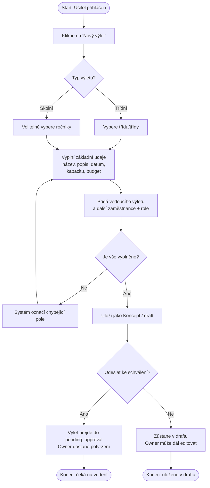
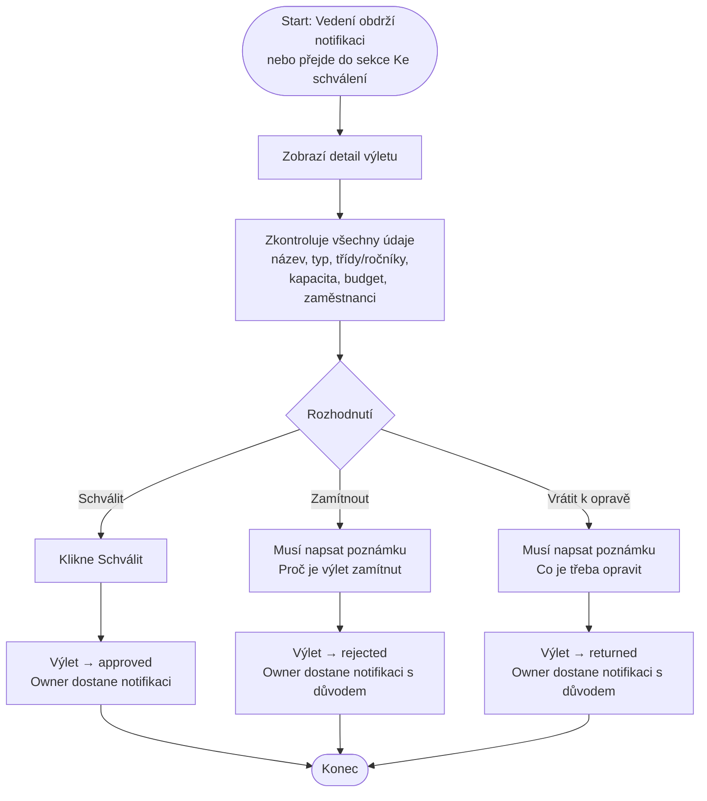
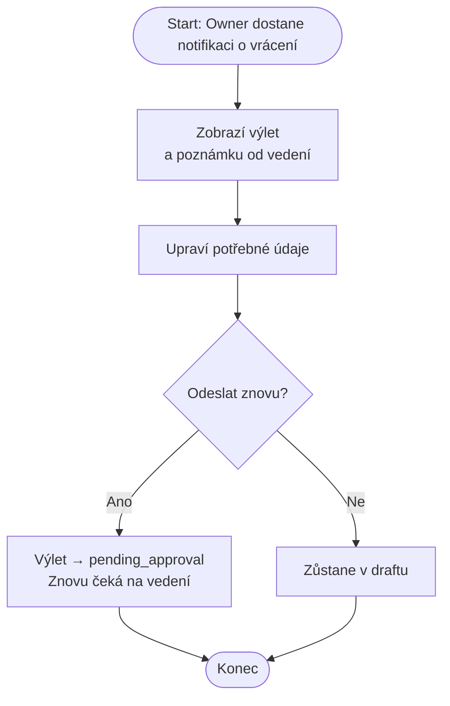
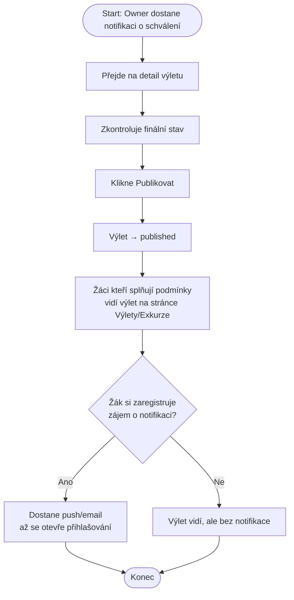
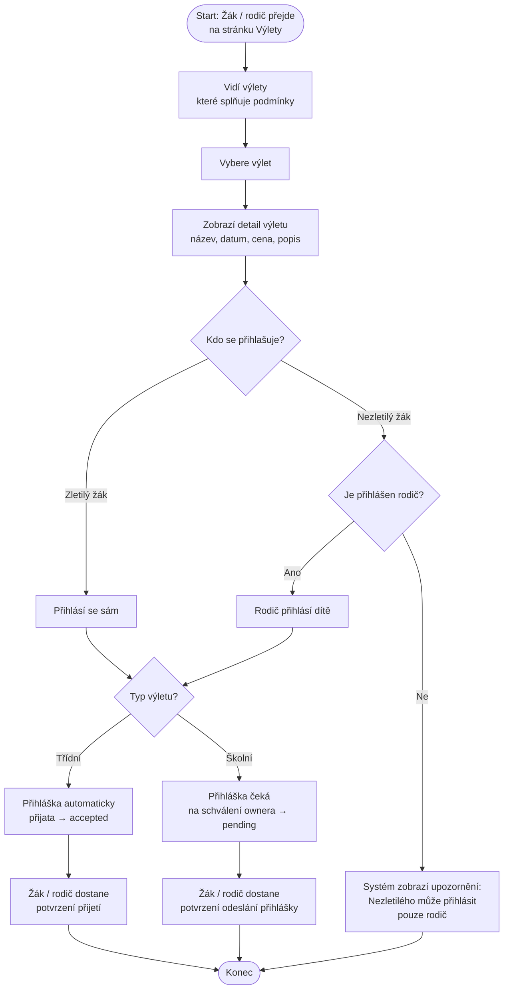
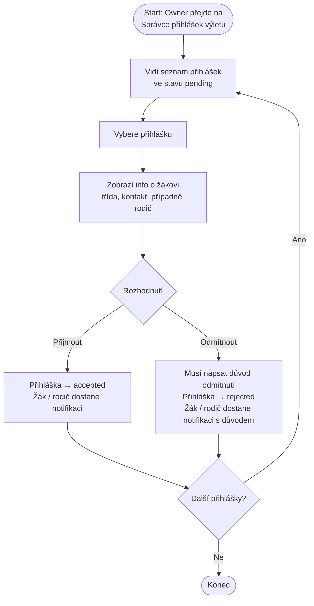
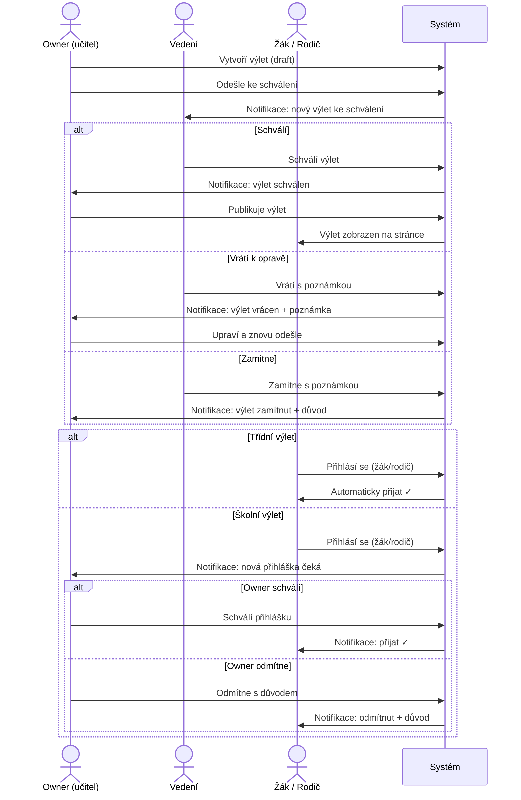

# User Flow Diagramy

## 1. Učitel — Vytvoření a odeslání výletu ke schválení

---

## 2. Vedení školy — Schvalování výletu

---

## 3. Učitel — Reakce na vrácení k opravě

---

## 4. Učitel — Publikování schváleného výletu

---

## 5. Žák / Rodič — Přihlášení na výlet

---

## 6. Owner výletu — Schvalování přihlášek (pouze školní výlet)

---

## 7. Celkový přehled — Orchestrace procesu

